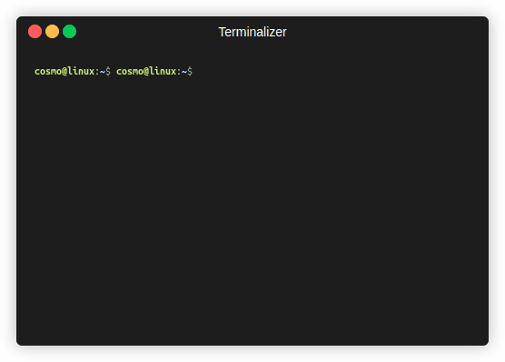

# System Initialization Script

A Python script for system initialization and setup with colorful banners.

## Overview

This Python script automates system initialization tasks, such as checking system resources, starting services, and displaying a colorful welcome banner. It provides a visual and informative way to set up and prepare a system for use.

## Features

- Check system resources for errors.
- Start essential services like a firewall and SMART disk monitoring.
- Display a colorful and eye-catching welcome banner.
- Provides a progress bar for each initialization step.

## Getting Started

Follow the instructions below to get started with this system initialization script.

### Prerequisites

- **Python 3:** The script is written in Python 3. You can download and install Python 3 from [python.org](https://www.python.org/downloads/).

- **Smartmontools:** To perform disk health checks, this script relies on smartmontools. You can install smartmontools using a package manager. For instance, on Ubuntu or Debian-based systems, use apt:

    sudo apt-get install smartmontools

- **Figlet:** This script uses the `figlet` program to generate colorful banners. You can install `figlet` using the package manager for your system. For example, on Ubuntu or Debian-based systems, you can use `apt`:

    sudo apt-get install figlet

- Make sure that figlet is in your system's PATH after installation.

- **Python dependencies:** Install python dependencies via pip:

    pip install -r requirements.txt

### Installation

1. Clone the repository:
    
    git clone https://github.com/ChrisGarey/system-init-script.git

Navigate to the project directory:

    cd system-init-script

### Usage

Run the script:

    python system_init.py

Follow the on-screen instructions to initialize your system.

### Contributing

Contributions are welcome! If you'd like to contribute to this project, please follow the guidelines in the CONTRIBUTING.md file.
License

This project is licensed under the MIT License - see the LICENSE file for details.
Acknowledgments

    pySMART for SMART disk monitoring.
    rich for creating colorful and interactive console output.

Contact

If you have any questions or suggestions, please feel free to reach out to me:

    Email: chrisgarey2014@gmail.com
    GitHub: ChrisGarey

Support

For additional support or discussions, you can visit the GitHub Discussions section of this repository.

